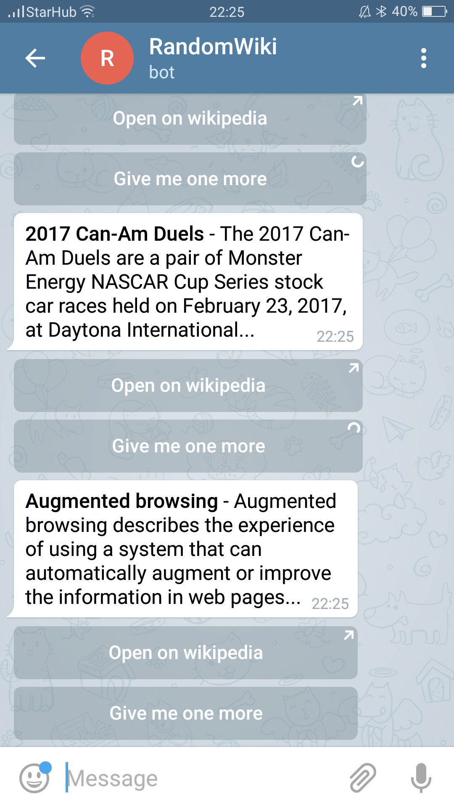

# WikiBot
Telegram Bot that will generate a random page from Wikipedia. For the bot wrapper, I used node-telegram-bot-api.

## Try it out!

Try the bot at https://t.me/rand_wiki_bot. Please kindly leave any feedback or suggestions.

## Running the source code

1. git clone https://github.com/DtCarrot/WikiBot.git
2. npm install 
3. create .env configuration (PORT, TElEGRAM_TOKEN, WEBHOOK_URL). 
  *Please note that you need a live webook_url in order for the bot to work* 
  Alternatively, you can use https://localtunnel.github.io/www/ to proxy your request to your local development machine. 
  
 
 
 
